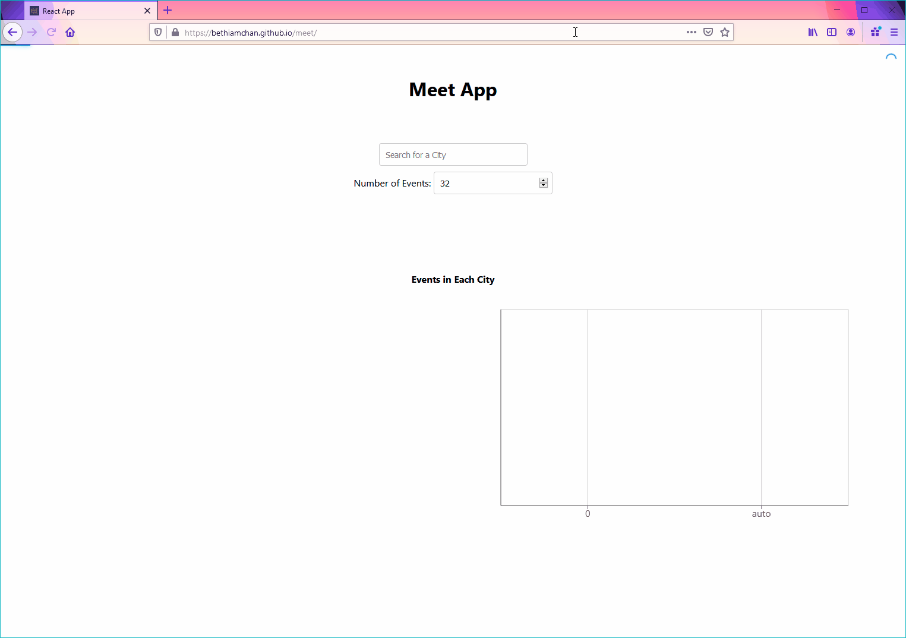

# **meet-app**
This project is a React PWA that uses the Google Calendar API. It fetches events so people can view a list of upcoming events and see data visualization charts about these events.

### [The application is deployed here, but your email must be added to a test list to gain access.](https://bethiamchan.github.io/meet/)

# Demo

# Features
* Users are authenticated and allow access to their calendars with Google OAuth2.
* The PWA displays a list of upcoming events.
* Data visualization charts are displayed with details about upcoming events.
* Users can view more details about individual events.
* Users can filter events by city.
* Users can change the number of events they see displayed.
* The app can be accessed offline and will show the details from the last online session.

# Technologies
* Code written with React framework
* Uses the Google Calendar API and OAuth2 authentication
* Uses AWS Lambda serverless functions
* Data visualization charts created with Recharts
